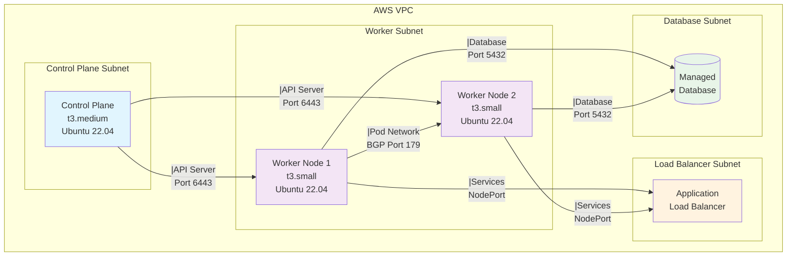

# Production-Ready Kubernetes Cluster on AWS

<div align="center">


*A comprehensive guide to deploying production-grade Kubernetes infrastructure from scratch*

</div>

---

## 🎯 Overview

This repository demonstrates how to deploy a **production-ready Kubernetes cluster** on AWS infrastructure **from scratch**. Unlike managed solutions, this approach provides deep insights into Kubernetes internals while maintaining production-grade standards.

### 🌟 Key Features

- 🔒 **Enterprise-grade security** with granular access controls
- 🌐 **Advanced networking** with Calico CNI and BGP configuration
- 🚀 **Infrastructure as Code** using Terraform
- 📊 **High observability** and troubleshooting capabilities
- 🔄 **Horizontal scalability** with multi-node architecture

---

## 🚀 Why Choose This Setup?

Most tutorials focus on "quick deployment," but production Kubernetes requires understanding of:

| Component | This Project | Typical Tutorials |
|-----------|-------------|-------------------|
| **Security** | Granular security groups, principle of least privilege | Wide-open security groups |
| **Networking** | BGP-enabled Calico, proper CIDR planning | Basic networking setup |
| **Runtime** | Optimized containerd with SystemD cgroups | Default configurations |
| **Reproducibility** | Full Terraform automation | Manual, error-prone steps |
| **Troubleshooting** | Production-ready debugging capabilities | Limited error handling |

---

## 🏗️ Architecture



### 🔧 Technical Specifications

- **Operating System**: Ubuntu 22.04 LTS
- **Container Runtime**: containerd with SystemD cgroups
- **CNI Plugin**: Calico v3.26.0 with BGP networking
- **Pod CIDR**: 192.168.0.0/16
- **Service CIDR**: 10.96.0.0/12
- **Infrastructure**: AWS EC2 with Terraform provisioning

---

## 📁 Project Structure

```
k8s-aws-production/
├── 📂 terraform/
│   ├── 🔧 main.tf              # Core AWS resources
│   ├── 📋 variables.tf         # Configuration variables
│   ├── 📤 outputs.tf          # Terraform outputs
│   └── 🛡️ security_groups.tf   # Security configurations
├── 📂 userdata/
│   ├── 🎛️ master.sh            # Control plane setup
│   └── 👷 worker.sh            # Worker node configuration
├── 📚 README.md               # This documentation
└── 🚫 .gitignore              # Git ignore rules
```

---

## 🚦 Quick Start

### Prerequisites

- AWS CLI configured with appropriate permissions
- Terraform >= 1.6 installed
- SSH key pair for EC2 access

### 1. Clone and Initialize

```bash
# Clone the repository
git clone https://github.com/<your-username>/k8s-aws-production.git
cd k8s-aws-production/terraform

# Initialize Terraform
terraform init
```

### 2. Deploy Infrastructure

```bash
# Review planned changes
terraform plan

# Apply configuration
terraform apply
```

### 3. Initialize Kubernetes

```bash
# SSH to control plane node
ssh -i your-key.pem ubuntu@<control-plane-ip>

# Initialize cluster
sudo kubeadm init \
  --pod-network-cidr=192.168.0.0/16 \
  --service-cidr=10.96.0.0/12 \
  --apiserver-advertise-address=<private-ip>
```

### 4. Install CNI

```bash
# Deploy Calico networking
kubectl apply -f https://raw.githubusercontent.com/projectcalico/calico/v3.26.0/manifests/calico.yaml

# Wait for Calico pods to be ready
kubectl wait --for=condition=Ready pod -l k8s-app=calico-node -n kube-system --timeout=300s
```

### 5. Join Worker Nodes

```bash
# On each worker node, run the join command from kubeadm init output
sudo kubeadm join <control-plane-ip>:6443 \
  --token <token> \
  --discovery-token-ca-cert-hash sha256:<hash>
```

---

## 🔍 Verification & Testing

### Cluster Health Check

```bash
# Verify all nodes are ready
kubectl get nodes -o wide

# Check system pods
kubectl get pods -n kube-system
```

### Network Connectivity Testing

```bash
# Test pod-to-pod communication
kubectl run test-pod-1 --image=busybox --command -- sleep 3600
kubectl run test-pod-2 --image=busybox --command -- sleep 3600

# Get pod IPs and test connectivity
kubectl get pods -o wide
kubectl exec test-pod-1 -- ping <test-pod-2-ip>
```

### Service Discovery Testing

```bash
# Create test deployment and service
kubectl create deployment nginx-test --image=nginx --replicas=3
kubectl expose deployment nginx-test --port=80 --type=ClusterIP

# Test service connectivity
kubectl run curl-test --image=curlimages/curl --rm -it --restart=Never -- curl nginx-test
```

---

## 🛠️ Troubleshooting Guide

<details>
<summary><strong>🚫 Control Plane Scheduling Issues</strong></summary>

**Problem**: Pods not scheduling on control plane node

**Solution**:
```bash
kubectl taint nodes --all node-role.kubernetes.io/control-plane-
```
</details>

<details>
<summary><strong>🌐 Calico BGP Connection Failures</strong></summary>

**Problem**: Pods can't communicate across nodes

**Solutions**:
1. Verify port 179 is open in security groups
2. Check Calico node status:
```bash
kubectl exec -n kube-system calico-node-xxx -- calicoctl node status
```
</details>

<details>
<summary><strong>⚙️ Kubelet CGroup Issues</strong></summary>

**Problem**: Kubelet fails to start pods

**Solution**: Ensure containerd config has:
```toml
[plugins."io.containerd.grpc.v1.cri".containerd.runtimes.runc.options]
  SystemdCgroup = true
```
</details>

<details>
<summary><strong>🔍 DNS Resolution Problems</strong></summary>

**Problem**: Pods can't resolve service names

**Solutions**:
1. Check CoreDNS pods: `kubectl get pods -n kube-system -l k8s-app=kube-dns`
2. Verify port 53 is allowed in security groups
</details>

---

## 📊 Production Readiness Checklist

- ✅ **Security**: Principle of least privilege implemented
- ✅ **Networking**: BGP-enabled pod networking configured
- ✅ **High Availability**: Multi-node cluster setup
- ✅ **Monitoring**: Cluster observability enabled
- ✅ **Backup**: etcd backup strategy (recommended)
- ✅ **Updates**: Rolling update capability verified
- ✅ **Scaling**: Horizontal pod autoscaling ready

---

## 📈 Key Learnings

> 🎓 **Educational Value**: This project provides hands-on experience with Kubernetes internals that managed services abstract away.

### Technical Insights

- **Networking Complexity**: Understanding BGP, pod CIDRs, and service networking
- **Security Groups**: Critical for cluster stability and security
- **Infrastructure as Code**: Ensures reproducible, version-controlled deployments
- **Container Runtime**: Deep dive into containerd and kubelet configuration
- **Troubleshooting**: Real-world problem-solving skills

### Production Skills Gained

- Manual cluster bootstrapping and management
- Advanced networking troubleshooting
- Security hardening techniques
- Infrastructure automation with Terraform
- Kubernetes networking deep dive

---

## 🚀 What's Next?

### Recommended Enhancements

- [ ] **Monitoring**: Add Prometheus and Grafana
- [ ] **Logging**: Implement ELK or EFK stack
- [ ] **GitOps**: Integrate ArgoCD or Flux
- [ ] **Service Mesh**: Deploy Istio or Linkerd
- [ ] **Backup**: Implement Velero for disaster recovery
- [ ] **Security**: Add Falco for runtime security

### Advanced Topics

- Multi-AZ deployment for high availability
- Cluster autoscaling with CA and HPA
- Custom resource definitions (CRDs)
- Operator pattern implementation

---

## 🤝 Contributing

Contributions are welcome! Please read our [Contributing Guidelines](CONTRIBUTING.md) before submitting PRs.

### Development Setup

1. Fork the repository
2. Create a feature branch
3. Test your changes thoroughly
4. Submit a pull request

---

## 📄 License

This project is licensed under the MIT License - see the [LICENSE](LICENSE) file for details.

---

## 📚 Additional Resources

- [Kubernetes Official Documentation](https://kubernetes.io/docs/)
- [Calico Networking Documentation](https://docs.projectcalico.org/)
- [Terraform AWS Provider](https://registry.terraform.io/providers/hashicorp/aws/latest/docs)
- [Production Kubernetes Best Practices](https://learnk8s.io/production-best-practices)

---

<div align="center">

**⭐ Star this repository if it helped you learn Kubernetes!**

Made with ❤️ by [Your Name](https://github.com/your-username)

</div>
